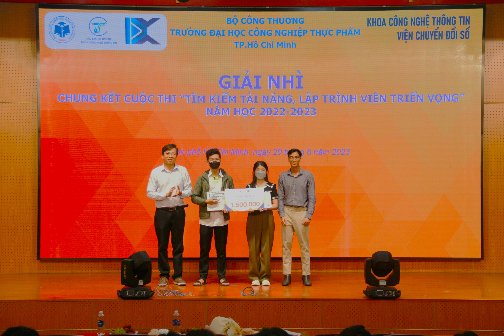
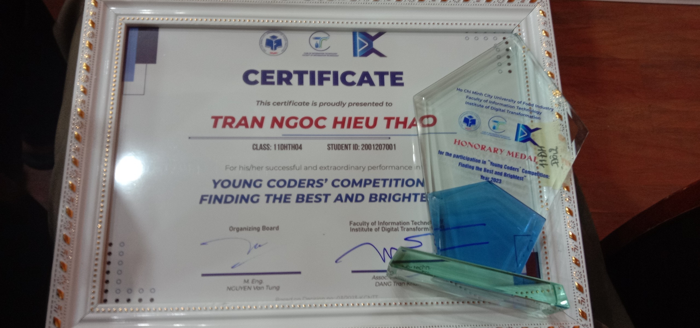
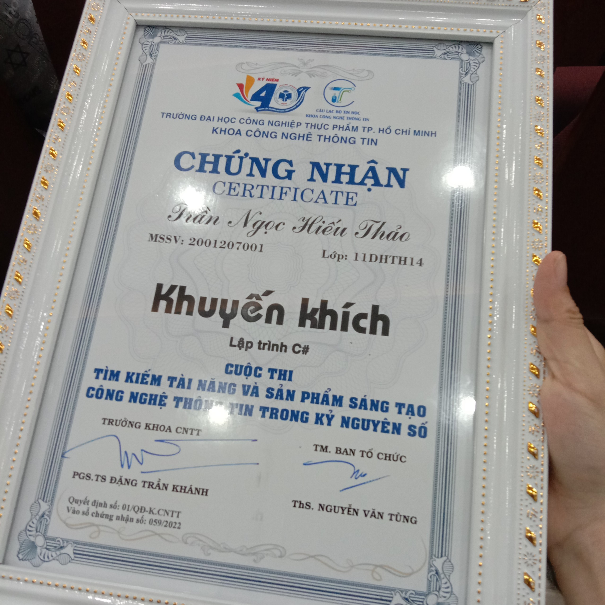

# 💫About Me :
### Hi, I'm Hieu Thao,   
A passionate and creative programmer.  
I create projects and share code on GitHub.   
I love building web applications and software,   
Always seeking opportunities to learn and develop my skills.   
Let's create innovative solutions and   
Contribute to the software development community together  

# 🌐Socials
 

# 💻Tech Stack
                	         
 
# 📊GitHub Stats :

## 🏆GitHub Trophies

## ✍️Random Dev Quote

# My external awards
 

   <!---->
  <!---->
 

 

  <!---->

---

